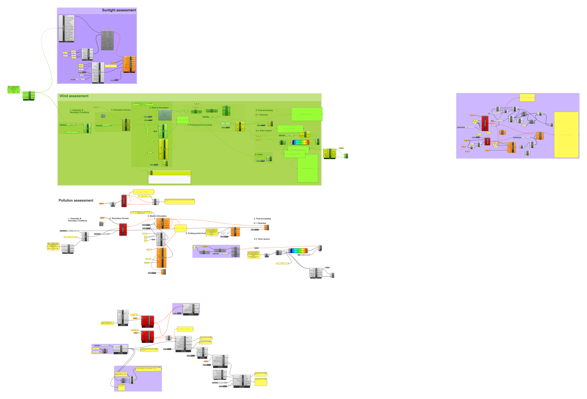
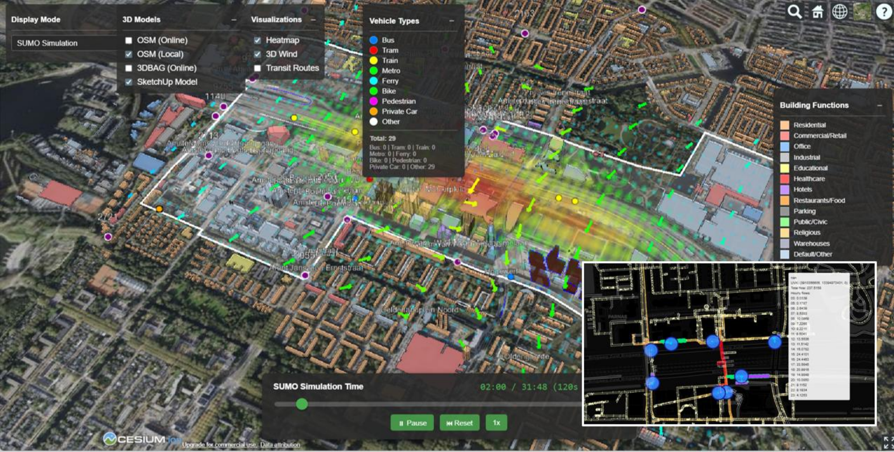
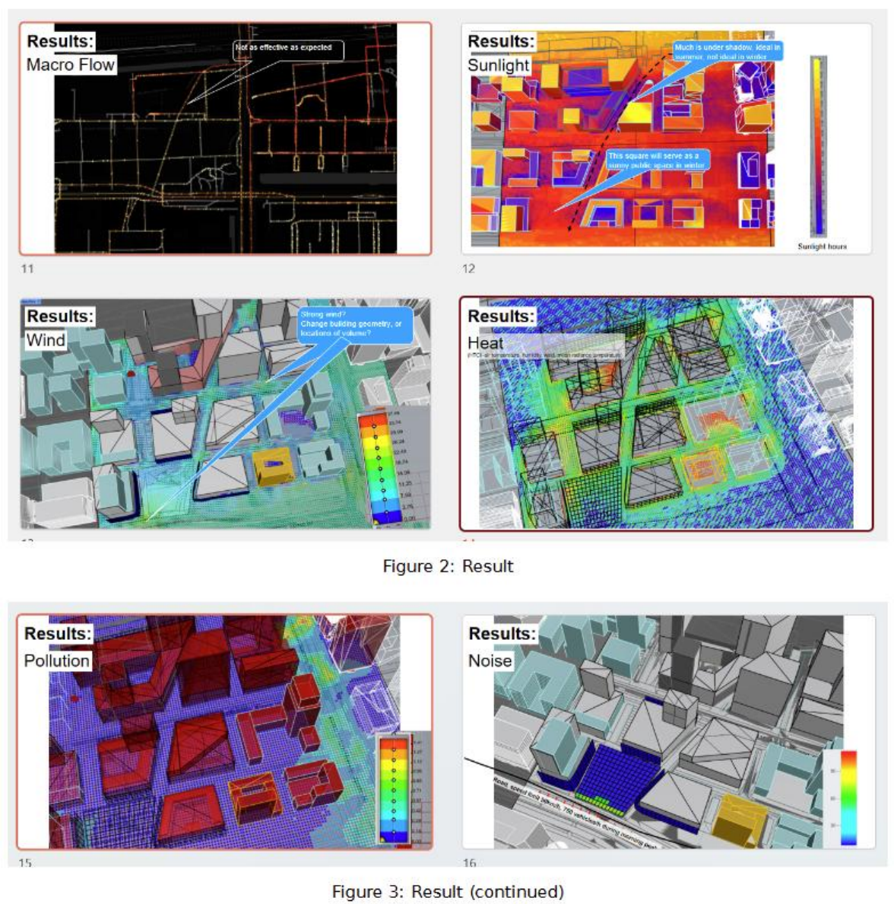
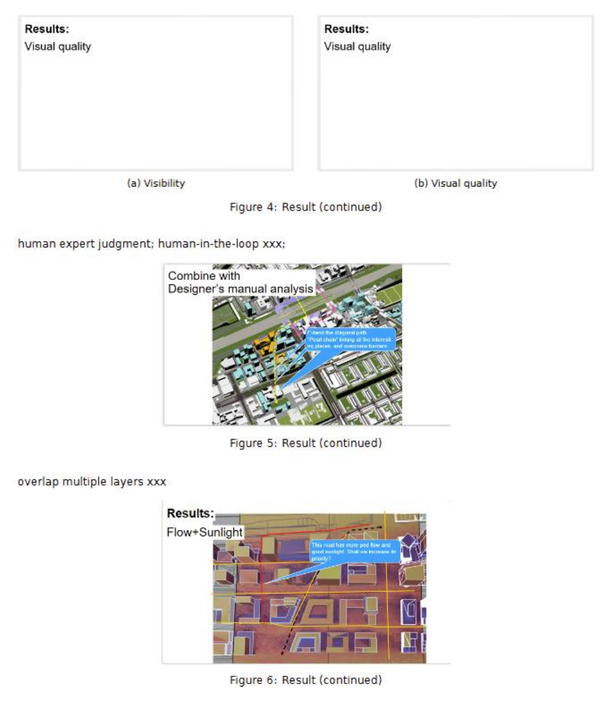
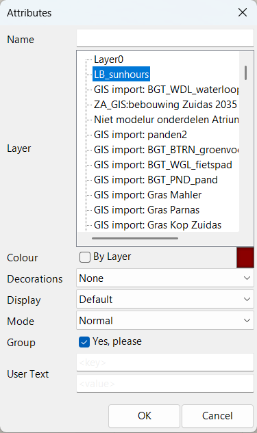
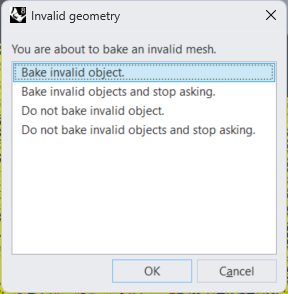
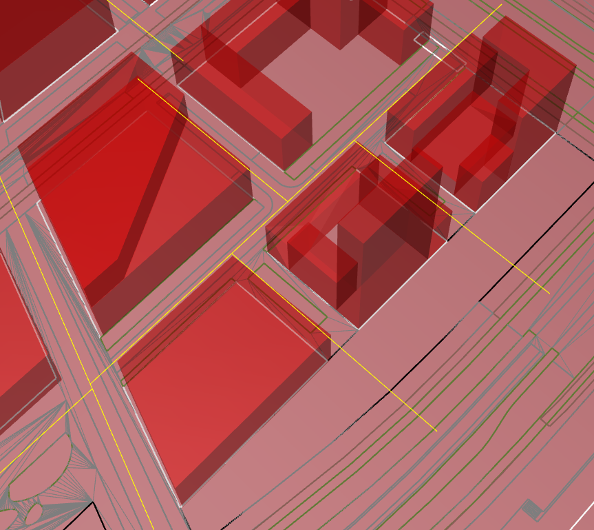

<h1 style="font-weight: normal; line-height: 1.35; border-bottom: none; text-align: center;">
  Assessing Multisensory User Experience (AMUSE)<br>
  <span style="font-size: 0.8em; font-weight: 300;">User Documentation</span>
</h1>


This project presents an workflow, or assessment framework, **AMUSE**, for **A**ssessing **M**ultisensory **US**er **E**xperience.

**Live viewer: <https://multisensory-digital-twin.web.app/>** · **Source: <https://github.com/1309928130/amuse-digital-twin>**


## Table of Contents

- [1. Introduction and overview](#1-introduction-and-overview)
- [Initial results](#initial-results)
- [2. Macroscopic pedestrian flow simulation](#2-macroscopic-pedestrian-flow-simulation)
- [3. Microscopic pedestrian flow simulation](#3-microscopic-pedestrian-flow-simulation)
- [4. Sunlight simulation](#4-sunlight-simulation)
- [5. Wind simulation](#5-wind-simulation)
- [6. Traffic pollution simulation](#6-traffic-pollution-simulation)
- [7. Urban heat simulation](#7-urban-heat-simulation)
- [8. Traffic noise simulation](#8-traffic-noise-simulation)
- [9. Visibility and visual quality assessment](#9-visibility-and-visual-quality-assessment)
- [10. Federated digital-twin visualization](#10-federated-digital-twin-visualization)
- [Appendix 1. Data preparation manual for designer teams](#appendix-1-data-preparation-manual-for-designer-teams)
- [Appendix 2. Glossary](#appendix-2-glossary)
- [Appendix 3. Complementary design generation with Mycelium](#appendix-3-complementary-design-generation-with-mycelium)
- [Contributions](#contributions)

## 1. Introduction and overview


### Aim

[User experience](https://www.sciencedirect.com/science/article/pii/S0195925524002725) is a key consideration in urban design. Assessing it in design proposals supports design evaluation and iteration before a scheme is built.
Multisensory user experience assessment is still uncommon. Sensory qualities (movement, visual comfort, sunlight, wind, noise, pollution, etc.) are often studied separately across different disciplines, with separeated datasets, models, and software, which make the results hard to be compared and synethesized. 

This project establishes a workflow for assessing multisensory user experience in a design or case-study area at the **design stage**. The assessments are brought together as comparable maps of indicator values, which can be overlaid and synthesised to see alignment or conflicts of different spatial qualities.
The assessments scope matches typical urban-design practice, with **case area sizes** of several square kilometres, and street-level outputs at a **spatial resolution** at metre scales.

### Workflow

Figure 1 summarises the workflow. The simulations cover **macroscopic and microscopic pedestrian movement**, **visibility**, **visual quality**, **sunlight**, **wind**, **pollution**, **heat**, and **noise**.

Each simulation has **input data**, **software**, and **output**. The workflow uses both existing software and self-developed software. Self-developed scripts bridge different parts of the workflow where needed. A final step overlays the different output maps.

<p align="center">
  <a href="./figures/framework_overall.png" target="_blank">
  
  </a>
</p>
<p align="center">Figure 1. Overall workflow</p>


Some input data are shared across simulations (e.g. 3D building geometries for sunlight, wind, noise, and pollution). Output maps can be overlaid on the same street-level grid to compare qualities. Some modules also depend on outputs of other modules:

- [Wind](#5-wind-simulation) results provide the basis for [traffic pollution](#6-traffic-pollution-simulation) (wind field as the transport medium) and [urban heat](#7-urban-heat-simulation). Wind, heat, and pollution can all be regarded as CFD (computational fluid dynamics) workflows.
- The [macroscopic pedestrian model](#2-macroscopic-pedestrian-flow-simulation) produces demand / OD outputs that feed [microscopic pedestrian simulation](#3-microscopic-pedestrian-flow-simulation).
- Microscopic [trajectories](#3-microscopic-pedestrian-flow-simulation) are used in [visual quality assessment](#9-visibility-and-visual-quality-assessment) to place simulated pedestrians in scene views.

Methods vary by module. [Microscopic pedestrian simulation](#3-microscopic-pedestrian-flow-simulation) and [visual quality assessment](#9-visibility-and-visual-quality-assessment) are **agent-based**: they follow simulated user trajectories. The other assessments are **grid-based**: the study area is divided into small cells that serve as computing units. [Macroscopic pedestrian flow prediction](#2-macroscopic-pedestrian-flow-simulation) is more complex. It follows a classic four-step traffic modelling framework and uses the road network, building information, and travel data.


### Data 

The workflow is intended for use at the **design stage**. It does not require case-specific measured real-world data (e.g. real-world street photos, pedestrian counts). Instead, it works with design proposals (building locations, geometries, and functions) and standard reference datasets such as climate files and national travel surveys, which are already available when design alternatives are being compared. To prepare the data, see [Appendix 1 (Data preparation manual for designer teams)](#appendix-1-data-preparation-manual-for-designer-teams).


<!-- Different assessment modules share overlapping input requirements. The table below summarises the main data types and which analyses they support. A practical reading order is to skim the assessment methods in the later sections first, then return here to see which data each one needs. -->

<table style="border-collapse: collapse; width: 100%; border: 0px solid #2b5c8f;">
  <thead>
    <tr style="background-color: rgb(228, 228, 228); border-bottom: 0px solid #2b5c8f;">
      <th style="border: 0px solid #cbd5e1; padding: 4px 10px; text-align: left;">Input data</th>
      <th style="border: 0px solid #cbd5e1; padding: 4px 10px; text-align: left;">Used for</th>
    </tr>
  </thead>
  <tbody>
    <tr style="background-color: rgb(247, 246, 246);">
      <td style="border: 0px solid #cbd5e1; padding: 4px 10px;"><em>3D building geometries</em></td>
      <td style="border: 0px solid #cbd5e1; padding: 4px 10px;">Visibility, sunlight, wind, traffic pollution, heat, and traffic noise simulation</td>
    </tr>
    <tr style="background-color: rgb(247, 246, 246);">
      <td style="border: 0px solid #cbd5e1; padding: 4px 10px;"><em>Climate data</em> (e.g. EPW)</td>
      <td style="border: 0px solid #cbd5e1; padding: 4px 10px;">Sunlight, wind, traffic pollution, and heat simulation</td>
    </tr>
    <tr style="background-color: rgb(247, 246, 246);">
      <td style="border: 0px solid #cbd5e1; padding: 4px 10px;"><em>Street design data</em> 
      <!-- (buildings, trees, walkable areas) -->
      </td>
      <td style="border: 0px solid #cbd5e1; padding: 4px 10px;">Visual quality analysis</td>
    </tr>
    <tr style="background-color: rgb(247, 246, 246);">
      <td style="border: 0px solid #cbd5e1; padding: 4px 10px;"><em>2D road networks</em>, <em>2D buildings</em>, <em>parking space</em>, and <em>transport nodes</em></td>
      <td style="border: 0px solid #cbd5e1; padding: 4px 10px;">Macroscopic pedestrian flow simulation</td>
    </tr>
    <tr style="background-color: rgb(247, 246, 246);">
      <td style="border: 0px solid #cbd5e1; padding: 4px 10px;"><em>Vehicle flow data</em></td>
      <td style="border: 0px solid #cbd5e1; padding: 4px 10px;">Traffic pollution and noise simulation</td>
    </tr>
  </tbody>
</table>


<!-- - *2D road networks*, *2D building*, *3D building geometries*, -->


<!-- ### Explanations on data  -->
Data file formats:
- *Vehicle flow data*: Refers to the hourly vehicle number and vehicle speed on road links, (e.g., 750 cars/hour on De Boelelaan street, maximum speed 50km/h, in morning peak hours on a weekday). In this project, the data was aquired from Amsterdam municipality, exported from *<a href="https://maps.amsterdam.nl/verkeersprognoses/">VMA</a>* model that runs on *<a href="https://www.goudappel.nl/expertises/Data-en-IT-oplossingen/OmniTRANS-Powered-by-Bentley-OpenPaths">OmniTRANS</a>* software.
- *Climate data*: <a href="https://designbuilder.co.uk/cahelp/Content/EnergyPlusWeatherFileFormat.htm">EPW</a>: hourly weather file for a single weather-station location (e.g. solar radiation, temperature, wind), not an average over a mapped area. For the Zuidas case we used the <a href="https://climate.onebuilding.org/WMO_Region_6_Europe/NLD_Netherlands/NH_Noord-Holland/NLD_NH_Amsterdam-Schipol.AP.062400_TMYx.zip">Amsterdam–Schiphol Airport TMYx</a> file (WMO 06240) as a regional climate approximation (~8–9&nbsp;km from Zuidas).

<!-- - `xxx.py`: a Python script for importing traffic data exported from OmniTRANS. **QGIS** is used to read the OmniTRANS export; this script runs in QGIS. -->


### Software 

Three main software programmes, which can also be seen as 'platforms', are used. They are
<strong><em><a href="https://www.rhino3d.com/">Rhino</a></em></strong>, 
<strong><em><a href="https://sumo.dlr.de/docs/index.html#introduction">SUMO</a></em></strong>, and <strong><em><a href="https://www.python.org/">Python</a></em></strong>. Most environmental workflows start from the Rhino ecosystem:

- <a href="https://www.rhino3d.com/">Rhino</a> is a 3D modelling environment. It has many plugins, and plugins' plugins (See [Food4Rhino](https://www.food4rhino.com/en)). One powerful <strong>Rhino plugin</strong> is Grasshopper:
    - <a href="https://www.grasshopper3d.com/">Grasshopper</a>: visual scripting plugin inside Rhino; orchestrates data preparation and simulation workflows. Grasshopper has many plugins.
- **Grasshopper plugins** used:
  - <a href="https://www.ladybug.tools/">Ladybug</a>: sunlight simulation
  - <a href="https://www.food4rhino.com/en/app/pachyderm-acoustical-simulation">Pachyderm Acoustics</a>: traffic noise simulation
  - <a href="https://eddy3d.com/">Eddy3D</a>: outdoor wind simulation (connects to the CFD backend below)


- **CFD (computational fluid dynamics) backend** (used by Eddy3D for wind and pollution):
  - <a href="https://openfoam.org/">OpenFOAM</a>: open-source CFD solver
  - <a href="https://bluecfd.github.io/Core/">blueCFD-Core</a>: Windows distribution of OpenFOAM 8


Recommended **software installation order:** Rhino (Grasshopper included) → Ladybug, Pachyderm Acoustics, Eddy3D → blueCFD-Core (OpenFOAM included) → Python → SUMO.

Prior to this project, the relevant tools have **two levels of isolation**: (1) **Software / platform level**: Rhino, SUMO, Python (e.g. the macroscopic pedestrian model), and QGIS. Python scripts can run standalone, but Rhino and SUMO also support Python execution or interaction; (2) **Plugin level**: separate Grasshopper plugins inside Rhino (Ladybug, Eddy3D, Pachyderm Acoustics, etc.). Self-developed **Python scripts** bridge the software / platform level; **Grasshopper scripts** bridge the plugin level. They are listed in each simulation section. The snapshots below are demonstrative.

<p align="center">
  <a href="./figures/snapshot_of_gh_scripts.png" target="_blank">
  
  </a>
</p>
<p align="center">Figure 2. Snapshot of Grasshopper scripts (demonstrative)</p>

<p align="center">
  <!-- Add figures/snapshot_of_py_scripts.png when available -->
</p>
<p align="center">Figure 3. Snapshot of Python scripts (demonstrative)</p>


## Initial results

<a id="initial-results"></a>

*Temporary section.* Example outputs from the AMUSE workflow on a Zuidas case study. In the final version, each result will be shown in its corresponding simulation section (§§2–9). Click any figure to open the full-resolution PDF.

<p align="center">
  <a href="./figures/QQ20260902-134624.pdf" target="_blank">
  
  </a>
</p>
<p align="center">Figure A. Microscopic pedestrian simulation (SUMO) in the federated digital-twin viewer — building functions, wind, and traffic heatmap.</p>

<p align="center">
  <a href="./figures/QQ20260902-134802.pdf" target="_blank">
  
  </a>
</p>
<p align="center">Figure B. Traffic pollution and traffic noise (panels 15–16).</p>

<p align="center">
  <a href="./figures/QQ20260902-134819.pdf" target="_blank">
  
  </a>
</p>
<p align="center">Figure C. Visibility, visual quality, designer judgment, and multi-layer overlap (flow + sunlight; panels 17–18).</p>

## 2. Macroscopic pedestrian flow simulation

For macroscopic pedestrian flow simulation, we use a macroscopic pedestrian model, **PedMac**, which was developed in parallel with this project. This software has not been open-sourced yet. You can use **[UNA](https://cityform.mit.edu/projects/una-rhino-toolbox)** (Urban Network Analysis) as an alternative.

PedMac predicts pedestrian flow on a road network and is applicable to areas of several square kilometres. It is based on a three-step modelling approach: travel demand, trip distribution, and route assignment. The corresponding outputs are *travel demand* at origins, an *origin–destination (OD) matrix* (which can feed [microscopic pedestrian models](#3-microscopic-pedestrian-flow-simulation)), and ***pedestrian flows*** on road links (the hourly number of pedestrians that pass each road segment). 


<table style="border-collapse: collapse; width: 100%; border: 0px solid #2b5c8f;">
  <thead>
    <tr style="background-color: rgb(228, 228, 228); border-bottom: 0px solid #2b5c8f;">
      <th style="border: 0px solid #cbd5e1; padding: 4px 10px; text-align: left;">Input data</th>
      <th style="border: 0px solid #cbd5e1; padding: 4px 10px; text-align: left;">Software</th>
      <th style="border: 0px solid #cbd5e1; padding: 4px 10px; text-align: left;">Output</th>
    </tr>
  </thead>
  <tbody>
    <tr style="background-color: rgb(247, 246, 246);">
      <td style="border: 0px solid #cbd5e1; padding: 4px 10px;">
        <em>&bull; 2D road networks</em><br>
        <em>&bull; 2D buildings<sup>1</sup></em><br>
        <!-- <br><em>&bull; Amenities as points</em> (POIs) -->
        <em>&bull; Parking space and transport nodes<sup>1</sup></em><br>
        <em>&bull; Travel survey data<sup>2</sup></em>
      </td>
      <td style="border: 0px solid #cbd5e1; padding: 4px 10px;"><em>PedMac</em> or <em>UNA</em></td>
      <td style="border: 0px solid #cbd5e1; padding: 4px 10px;">Pedestrian <em>travel demand</em>, <em>OD matrix</em>, and <em>flow volumes</em></td>
    </tr>
  </tbody>
</table>

<p style="margin-top: 8px; margin-left: 1.5em; padding-left: 0.5em; font-size: 0.9em; color: #666; line-height: 1.5;">
  <sup>1</sup> As polylines or points, with information on <em>locations</em>, <em>quantities</em>, and <em>functions</em>.<br>
  <sup>2</sup> e.g. <a href="https://www.cbs.nl/en-gb/our-services/methods/surveys/brief-survey-description/dutch-national-travel-survey">ODiN</a> (Dutch National Travel Survey).
</p>

<!-- (this software is in the form of Python script) -->


Figure xxx. The output of PedMac prediction: pedestrian flow in road networks

PedMac link flows and trip-generation demand can also be inspected in the [federated digital-twin visualization](#10-federated-digital-twin-visualization) (§10), including hover tooltips with hourly flow profiles.


## 3. Microscopic pedestrian flow simulation


<table style="border-collapse: collapse; width: 100%; border: 0px solid #2b5c8f;">
  <thead>
    <tr style="background-color: rgb(228, 228, 228); border-bottom: 0px solid #2b5c8f;">
      <th style="border: 0px solid #cbd5e1; padding: 4px 10px; text-align: left;">Input data</th>
      <th style="border: 0px solid #cbd5e1; padding: 4px 10px; text-align: left;">Software</th>
      <th style="border: 0px solid #cbd5e1; padding: 4px 10px; text-align: left;">Output</th>
    </tr>
  </thead>
  <tbody>
    <tr style="background-color:rgb(247, 246, 246);">
      <td style="border: 0px solid #cbd5e1; padding: 4px 10px;">
        <em>&bull; Origin–destination (OD) matrix<sup>1</sup></em><br>
        <em>&bull; 3D road data<sup>2</sup></em>
      </td>
      <td style="border: 0px solid #cbd5e1; padding: 4px 10px;"><em>SUMO</em>, <em>MassMotion</em> or <em>Kova PedSim</em></td>
      <td style="border: 0px solid #cbd5e1; padding: 4px 10px;"><em>Travel time</em> and detailed pedestrian <em>flows / trajectories</em></td>
    </tr>
  </tbody>
</table>

<p style="margin-top: 8px; margin-left: 1.5em; padding-left: 0.5em; font-size: 0.9em; color: #666; line-height: 1.5;">
  <sup>1</sup> Macroscopic pedestrian flow output data.<br>
  <sup>2</sup> Actually, it is 2.5D in transport simulation xxx xxx.
</p>

The microscopic simulation was migrated from SUMO/MassMotion to **Kova PedSim**, a
Grasshopper plugin, so that the agent simulation runs inside the same modelling
environment as the rest of the assessment pipeline. The working definition is
`micro_mobility_simulation_export.ghx`.

Because Kova's simulation objects expose only the inherited `System.Object`
members to Rhino's Python 3 (their own fields are not reachable from dynamic
scripting), the export does not read them directly. It goes through the plugin's
own **Kova Deconstruct Element**, whose `Footpath` output is passed through `Pt`
and `pDecon` so the trajectories arrive at the exporter as plain numbers.

- `tools/gh_export_footpaths.py`: a Python 3 Script component that converts the
  simulation output into the viewer's JSON format
  (`simulation_data/proposal-1/agent_trajectories.json`). Its `report` output
  prints a running total as it appends, one agent per evaluation.

To export a run:

1. Set the `xs` / `ys` / `zs` inputs of the Python component to **List Access**.
   On Item Access the component runs once per coordinate instead of once per
   agent, and the export is silently fragmented.
2. Reload the web viewer. The micro-mobility page picks the trajectories up
   automatically.

> **Before each new run, delete `agent_trajectories.json`.**
> The export **appends**, because Grasshopper calls the component once per agent
> and it cannot tell a fresh run from a repeat. Run the simulation twice without
> deleting the file and you get **150 agents instead of 75** — with no error, and
> a report that reads "total 150 agents". The first line of the report reads
> `STARTED FILE:` when the file was genuinely empty; if a fresh run does not
> start with that, the old file is still there.

### Notes on the agent data

- **Coordinates.** Trajectories are exported in Rhino model metres (EPSG:28992,
  RD New) and transformed to WGS84 with the same local affine used by the wind
  and pollution builds, minus their `CASE_OFFSET`.
- **Time.** Kova advances in discrete iterations and defines no seconds value, so
  speeds are per-iteration distances divided by a **nominal** seconds-per-iteration
  constant, calibrated so that the run's median speed is a plausible walking pace.
  The metadata records `speed_unit_base: "nominal"` so the figures are not mistaken
  for measurements. They are indicative, not measured.
- **Elevation.** The deconstructor's `Z` output is currently zero for every point,
  so elevation carries no information and is omitted from the export.
- **Avatars.** Trajectories are rendered as rigged walking figures: Quaternius'
  *Universal Animation Library* (CC0), one character shared by all agents and
  tinted per agent so a crowd reads as several people. Only its `Walk_Loop` clip
  is kept, because Cesium's `runAnimations` is a boolean that plays every clip in
  a file at once and cannot select one by name; the other 42 clips are removed
  from the asset by `tools/prune_glb_animations.py`. An earlier character pack was
  abandoned because its FBX conversion expressed the unit conversion as a
  `scale: 100` on the armature, which Cesium rendered a hundred times too large
  while reporting a normal-sized bounding sphere.
- **The walk cycle is driven by the scene clock.** Cesium computes a clip's pose
  from the scene time alone, so the viewer advances its clock from the same tick
  that moves the agents. This keeps the stride tied to the ground covered and lets
  the speed control govern both. The clock is stopped again when the layer is
  hidden, so it does not run for other time-dependent layers.
- **Route lines.** The agent paths are drawn as lines only when *Route lines* is
  ticked in the Layers panel. They are **off by default**: Kova re-plans every
  iteration, so a full run traces a dense grid over the street that hides the
  agents it is meant to explain. They remain available as a debugging aid, and
  hiding them does not affect the agents or the animation.


## 4. Sunlight simulation


<table style="border-collapse: collapse; width: 100%; border: 0px solid #2b5c8f;">
  <thead>
    <tr style="background-color: rgb(228, 228, 228); border-bottom: 0px solid #2b5c8f;">
      <th style="border: 0px solid #cbd5e1; padding: 4px 10px; text-align: left;">Input data</th>
      <th style="border: 0px solid #cbd5e1; padding: 4px 10px; text-align: left;">Software</th>
      <th style="border: 0px solid #cbd5e1; padding: 4px 10px; text-align: left;">Output</th>
    </tr>
  </thead>
  <tbody>
    <tr style="background-color: rgb(247, 246, 246);">
      <td style="border: 0px solid #cbd5e1; padding: 4px 10px;"><em>&bull; 3D building geometries</em><br><em>&bull; Climate data^1</em> (EPW or equivalent)</td>
      <td style="border: 0px solid #cbd5e1; padding: 4px 10px;"><em>Ladybug</em> (Rhino + Grasshopper)</td>
      <td style="border: 0px solid #cbd5e1; padding: 4px 10px;">Coloured <em>sunlight-hours</em> mesh (GLB) for the web viewer</td>
    </tr>
  </tbody>
</table>

^1 climate data, or simply the geographical coordinates are enough?

- Grasshopper definition: `XCarCity/Grasshopper_scripts.ghx` (Ladybug **LB Direct Sun Hours**).
- Web viewer layer: **Sunlight** checkbox in `visualization/` (loads `visualization/simulation_data/sunlight/sunlight_analysis_wgs84ready.glb` and temporarily hides design GLBs).

### Export pipeline (bake → GLB → web)

1. Run Direct Sun Hours with a dense analysis mesh (see pitfall below).
2. Bake the coloured **`mesh`** output into Rhino:
   - Layer: dedicated layer such as `LB_sunhours` (not `PM_BUILDINGS`).
   - **Colour: not “By Layer”** (keep mesh / Ladybug colours).
   - Group: optional but useful.
3. If Rhino warns about an invalid mesh, choose **Bake invalid object** once (do not pick “stop asking” unless you intend to).
4. Export the baked mesh as **glTF/GLB** into `visualization_data/` (e.g. `sunlight_analysis.glb`), then copy into the web app `simulation_data/sunlight/` (re-center for Cesium if the GLB still uses absolute RD coordinates).

<p align="center">
  
</p>
<p align="center">Figure. Bake Attributes — use layer <code>LB_sunhours</code>, uncheck Colour “By Layer”, optionally group.</p>

<p align="center">
  
</p>
<p align="center">Figure. Invalid-mesh bake dialog — select “Bake invalid object” if the Ladybug mesh is flagged invalid.</p>

### Pitfall: analysis resolution follows the Rhino mesh, not only `_grid_size`

Ladybug **LB Direct Sun Hours** colours faces of the analysis mesh. A common mistake is to keep tuning the Grasshopper `_grid_size` slider when the ground (or other surfaces) still looks flat / under-resolved (e.g. a single solid colour over a whole courtyard).

**What actually controls detail:** how many faces the mesh already has. That density comes from the **Rhino surface UV subdivisions** used when the mesh was built from the surface (or from how the mesh was reconstructed). More UV / mesh sub-pieces → more sample faces → a finer coloured map. If the input mesh is coarse, changing `_grid_size` alone will not create a detailed sunlight field.

**Practical checklist:**

1. In Rhino, increase surface **UV** (or rebuild / remesh the ground and façades) so the analysis mesh has enough faces at street scale.
2. For **ground-level** hours: put the **ground** in `_geometry` and **buildings only** in `context_` (do not also put the ground in `context_`, or self-shadowing can zero out the results).
3. The Ladybug sun-path graphic often draws at the Rhino origin; that is only a diagram. Direct-sun rays use **direction vectors** and still apply correctly to geometry far from the origin (e.g. RD New coordinates).
4. For web display: prefer exporting the **baked coloured mesh as GLB**. Re-export with **vertex colours** preserved if the GLB shows a flat material colour instead of the Ladybug falsecolour.

## 5. Wind simulation

Outdoor wind field and comfort indicators; also the base case for pollution and heat simulation

<table style="border-collapse: collapse; width: 100%; border: 0px solid #2b5c8f;">
  <thead>
    <tr style="background-color: rgb(228, 228, 228); border-bottom: 0px solid #2b5c8f;">
      <th style="border: 0px solid #cbd5e1; padding: 4px 10px; text-align: left;">Input data</th>
      <th style="border: 0px solid #cbd5e1; padding: 4px 10px; text-align: left;">Software</th>
      <th style="border: 0px solid #cbd5e1; padding: 4px 10px; text-align: left;">Output</th>
    </tr>
  </thead>
  <tbody>
    <tr style="background-color: rgb(247, 246, 246);">
      <td style="border: 0px solid #cbd5e1; padding: 4px 10px;"><em>&bull; 3D building geometries</em><br><em>&bull; Climate data</em> (e.g., EPW)</td>
      <td style="border: 0px solid #cbd5e1; padding: 4px 10px;"><em>Rhino + Eddy3D</em> (OpenFOAM backend)</td>
      <td style="border: 0px solid #cbd5e1; padding: 4px 10px;">Outdoor <em>wind field</em> and <em>wind comfort</em> indicators</td>
    </tr>
  </tbody>
</table>

- `xxx.gh`: a Grasshopper script for wind simulation (adapted from an Eddy3D official template).


## 6. Traffic pollution simulation

Passive-scalar traffic pollution on top of an Eddy3D wind case (OpenFOAM 8 / blueCFD).

<table style="border-collapse: collapse; width: 100%; border: 0px solid #2b5c8f;">
  <thead>
    <tr style="background-color: rgb(228, 228, 228); border-bottom: 0px solid #2b5c8f;">
      <th style="border: 0px solid #cbd5e1; padding: 4px 10px; text-align: left;">Input data</th>
      <th style="border: 0px solid #cbd5e1; padding: 4px 10px; text-align: left;">Software</th>
      <th style="border: 0px solid #cbd5e1; padding: 4px 10px; text-align: left;">Output</th>
    </tr>
  </thead>
  <tbody>
    <tr style="background-color: rgb(247, 246, 246);">
      <td style="border: 0px solid #cbd5e1; padding: 4px 10px;"><em>&bull; The output of the wind simulation</em><br><em>&bull; 3D building geometries</em><br><em>&bull; Traffic flows</em></td>
      <td style="border: 0px solid #cbd5e1; padding: 4px 10px;"><em>blueCFD (OpenFOAM 8) + Eddy3D + Python scripts</em></td>
      <td style="border: 0px solid #cbd5e1; padding: 4px 10px;">Probe-based <em>pollution concentration</em> values</td>
    </tr>
  </tbody>
</table>

- `xxx.gh`: a Grasshopper script for pollution simulation. Use together with `xxx.py`.
- `xxx.py`: a Python script for processing the pollution simulation.


## 7. Urban heat simulation

UTIC: xxx xxx

<table style="border-collapse: collapse; width: 100%; border: 0px solid #2b5c8f;">
  <thead>
    <tr style="background-color: rgb(228, 228, 228); border-bottom: 0px solid #2b5c8f;">
      <th style="border: 0px solid #cbd5e1; padding: 4px 10px; text-align: left;">Input data</th>
      <th style="border: 0px solid #cbd5e1; padding: 4px 10px; text-align: left;">Software</th>
      <th style="border: 0px solid #cbd5e1; padding: 4px 10px; text-align: left;">Output</th>
    </tr>
  </thead>
  <tbody>
    <tr style="background-color: rgb(247, 246, 246);">
      <td style="border: 0px solid #cbd5e1; padding: 4px 10px;"><em>&bull; The output of the wind simulation</em><br><em>&bull; 3D building geometries</em><br><em>&bull; Climate data</em></td>
      <td style="border: 0px solid #cbd5e1; padding: 4px 10px;"><em>(TBD)</em></td>
      <td style="border: 0px solid #cbd5e1; padding: 4px 10px;"><em>Heat / thermal comfort</em> maps or probe values</td>
    </tr>
  </tbody>
</table>

- `xxx.gh`: a Grasshopper script for heat simulation.


## 8. Traffic noise simulation

Guidance for running this in Rhino! xxx xxx xxx

<table style="border-collapse: collapse; width: 100%; border: 0px solid #2b5c8f;">
  <thead>
    <tr style="background-color: rgb(228, 228, 228); border-bottom: 0px solid #2b5c8f;">
      <th style="border: 0px solid #cbd5e1; padding: 4px 10px; text-align: left;">Input data</th>
      <th style="border: 0px solid #cbd5e1; padding: 4px 10px; text-align: left;">Software</th>
      <th style="border: 0px solid #cbd5e1; padding: 4px 10px; text-align: left;">Output</th>
    </tr>
  </thead>
  <tbody>
    <tr style="background-color: rgb(247, 246, 246);">
      <td style="border: 0px solid #cbd5e1; padding: 4px 10px;"><em>&bull; 3D building geometries</em><br><em>&bull; Traffic flows</em></td>
      <td style="border: 0px solid #cbd5e1; padding: 4px 10px;"><em>Pachyderm Acoustics<sup>1</sup></em></td>
      <td style="border: 0px solid #cbd5e1; padding: 4px 10px;"><em>Traffic noise</em> values at each point on the streets and plazas</td>
    </tr>
  </tbody>
</table>

<p style="margin-top: 8px; margin-left: 0.6em; padding-left: 0.5em; font-size: 0.9em; color: #666; line-height: 1.5;">
<sup>1</sup> Pachyderm Acoustics works as a plugin in both Rhino and Grasshopper. For outdoor simulation, however, only <a href="https://discourse.mcneel.com/t/acoustic-study-for-street-noise/212411/2">the Rhino version works</a>. When setting it up, use a large resolution (e.g. 500&nbsp;cm); otherwise large outdoor scenes will run too slowly.
</p>


## 9. Visibility and visual quality assessment


For visibility assessment:

<table style="border-collapse: collapse; width: 100%; border: 0px solid #2b5c8f;">
  <thead>
    <tr style="background-color: rgb(228, 228, 228); border-bottom: 0px solid #2b5c8f;">
      <th style="border: 0px solid #cbd5e1; padding: 4px 10px; text-align: left;">Input data</th>
      <th style="border: 0px solid #cbd5e1; padding: 4px 10px; text-align: left;">Software</th>
      <th style="border: 0px solid #cbd5e1; padding: 4px 10px; text-align: left;">Output</th>
    </tr>
  </thead>
  <tbody>
    <tr style="background-color: rgb(247, 246, 246);">
      <td style="border: 0px solid #cbd5e1; padding: 4px 10px;"><em>&bull; 3D building geometries</em><br><em>&bull; Pedestrian trajectories</em></td>
      <td style="border: 0px solid #cbd5e1; padding: 4px 10px;"><em>Rhino + Python</em></td>
      <td style="border: 0px solid #cbd5e1; padding: 4px 10px;"><em>Visual quality</em> indicators at street level</td>
    </tr>
  </tbody>
</table>

For visual quality assessment:

<table style="border-collapse: collapse; width: 100%; border: 0px solid #2b5c8f;">
  <thead>
    <tr style="background-color: rgb(228, 228, 228); border-bottom: 0px solid #2b5c8f;">
      <th style="border: 0px solid #cbd5e1; padding: 4px 10px; text-align: left;">Input data</th>
      <th style="border: 0px solid #cbd5e1; padding: 4px 10px; text-align: left;">Software</th>
      <th style="border: 0px solid #cbd5e1; padding: 4px 10px; text-align: left;">Output</th>
    </tr>
  </thead>
  <tbody>
    <tr style="background-color: rgb(247, 246, 246);">
      <td style="border: 0px solid #cbd5e1; padding: 4px 10px;"><em>&bull; Street design<sup>1</sup></em></td>
      <td style="border: 0px solid #cbd5e1; padding: 4px 10px;"><em>Rhino + Python</em></td>
      <td style="border: 0px solid #cbd5e1; padding: 4px 10px;"><em>Visual quality</em> indicators at street level</td>
    </tr>
  </tbody>
</table>

<p style="margin-top: 8px; margin-left: 0.6em; padding-left: 0.5em; font-size: 0.9em; color: #666; line-height: 1.5;">
<em><sup>1</sup> Street design</em> here means a 3D file with <em>buildings</em>, <em>trees</em>, and <em>walkable areas</em> modelled in it.
</p>

- `xxx.py`: a Python script for visual quality assessment. Use together with the `.3dm` template file: xxx.


## 10. Federated digital-twin visualization

<a id="10-federated-digital-twin-visualization"></a>

AMUSE outputs are brought together in a Cesium-based 3D viewer under [`visualization/`](../../visualization/). The viewer overlays PedMac macroscopic results with environmental layers (urban heat, wind) and transit / SUMO content on the same Zuidas scene, so design alternatives can be compared spatially.

**Live viewer: <https://multisensory-digital-twin.web.app/>** — a hosted build of this viewer. Source: <https://github.com/1309928130/amuse-digital-twin>.

### PedMac layers in the viewer

| Toggle (Visualizations panel) | Source data | What you see |
|---|---|---|
| **Network Flow** | Hourly edge flows from PedMac assignment (`output/model_runs/edge_flows_from_cell66_3__*.parquet`) joined to `output/network/G_projected.graphml` | Road links coloured and thickened by daily pedestrian volume (YlOrRd). **Click** a link to see **daily total** and the **24-hour flow profile**. |
| **Pedestrian Demand** | Trip generation (`output/generated_trips.csv`) | Heatmap of daily generated trips at network / building snap locations (same family of maps as `heatmap.html` / `output/heatmap_demand_*.html`). |
| **Urban Heat** | Grasshopper / Ladybug export (`visualization/simulation_data/simulation_results_heat_wgs84.csv`) | Street-level heat field as vector glyphs. |

Standalone Folium HTML maps remain available for 2D inspection (`heatmap.html`, `output/network/flow_network_map.html`). The Cesium layers are the federated counterparts of those PedMac outputs.

### Click: hourly flow

With **Network Flow** enabled, **click** a coloured link (hover does nothing). A tooltip shows:

- Link name / highway type and edge key `(u, v, k)`
- Daily flow (sum of hourly volumes)
- Bar chart of pedestrians per hour for hours `00`–`23` (peak hour highlighted)

Click empty ground, or the tooltip **×**, to dismiss. This matches the hourly breakdown previously only available in the Folium flow-map popups.

<h3 id="multi-layer-overlap">Multi-layer overlap: why the layers are independent</h3>

The **multi-layer overlap** page switches every layer on at once so the assessment results can be compared at the same locations. It is important to read that view correctly: **the layers come from independent assessments.** They are not correlated, and their agreement or disagreement carries no statistical meaning, because the overlay is not one model — it is several separate results drawn on top of one another.

We do **not** have a holistic model built on all the sensory features together. Each quality is produced by its own module, with its own input data, software, assumptions and validation ([§§2–9](#2-macroscopic-pedestrian-flow-simulation)), and each is calibrated on its own. Overlaying them is a *visual* act: by simply putting different assessment qualities together, a designer can compare where qualities are balanced or imbalanced at all the locations across the area being examined. Where two layers coincide or conflict, that is a prompt to investigate further — not evidence that one model confirms, or contradicts, the other.

There are two reasons a holistic model is not available:

- **No dataset contains all the required data together.** Building a holistic model needs every sensory feature measured at the same places and times. In practice, barely any dataset holds those different kinds of data all in one place, and the workflow is deliberately designed for the **design stage**, where case-specific measured data is not available at all (see [§1 Data](#1-introduction-and-overview)).
- **The assessments run at different scales.** The different qualities are assessed at different **spatial and temporal scales and resolutions** — macroscopic pedestrian flow over a network of several square kilometres, for instance, against a visibility or visual-quality indicator computed along a pedestrian trajectory at eye level. Reconciling those into a single coupled model is not merely laborious; it is hard to define, which is what makes a holistic model hardly possible here.

So the overlap view is a **comparison tool, not a synthesis model**. Its value is that it puts heterogeneous results onto one scene and lets the eye spot spatial patterns — where comfort, movement, and environmental quality line up or work against each other — while each layer's own validity remains exactly what it is on its own page.

### Refreshing PedMac layers after a model run

From the PedModel project root:

```bash
python tools/export_cesium_pedflow.py
```

This writes:

- `visualization/simulation_data/network_flow_edges.json`
- `visualization/simulation_data/pedestrian_demand.json`
- `visualization/simulation_data/pedflow_manifest.json`

Optional flags: `--flows path/to/edge_flows.parquet`, `--min-flow`, `--pad` (degree padding around the Zuidas bounds).

### Running the viewer

The hosted build is at **<https://multisensory-digital-twin.web.app/>**.

To run it locally:

```bash
unset LD_LIBRARY_PATH
cd visualization
npm start
# open http://localhost:8080
```

Enable **Network Flow** and/or **Pedestrian Demand** in the Visualizations panel. Prefer **Analytical Mode** when inspecting coloured overlays without sun shadows.


## Appendix 1. Data preparation manual for designer teams


<details>
  <summary style="color: var(--vscode-textLink-foreground, #0969da); cursor: pointer; user-select: none;">(Click to expand)</summary>


  

<div style="background-color: rgb(247, 246, 246); border-radius: 6px; padding: 16px 20px; margin: 12px 0;">


For each **design proposals** or alternative, the following files are needed for conducting the assessment. These files should be provided by the **designers**.

### 1. Data for *macroscopic pedestrian flow* simulation

Aspects involved: road networks, building quantities, building functions, transport nodes, parking space, and areas of green/sport parks. The required data include 2D lines of building profiles and Center lines of new roads are needed:

#### 2D building data file

Provide 2D building profile lines with **attribute user text** documenting:

- `origin_type`
- `GFA`

The following `origin_type` values are allowed **:**

- `home`, `work`, `education`, `shopping`, `leisure` (assembly venues, hospitality, parks), `sport`, `healthcare`, `other`, `car_parking`, `bicycle_parking`, `motorcycle_parking`, `train_station`, `subway_station`, `tram_stop`, `bus_stop`

The example in Figure 1 is in the default Rhino format (`.3dm`). If you do not use Rhino, any common 2D format is fine (e.g. `dwg`, `dxf`, `shp`). Document the building information (`origin_type` and `GFA`) in a logical way in that format. 


Our pedestrian model snaps each building’s information to its nearest road links. Therefore, for large buildings, to make the simulation more accurate, we suggest separating them into smaller **sub-buildings**.

<p align="center">
  <a href="./figures/file_prep_figure_1.png" target="_blank">
  
  </a>
</p>
<p align="center" style="font-size: 0.9em; color: #666; line-height: 1.5; margin-top: 8px;">
  Figure 1. 2D building profiles with <code>origin_type</code> and <code>GFA</code> (Customly documented in 'Attribute User Text' property in Rhino)<br>
  Blue line = large building profile; yellow box lines = sub-buildings (information is stored on these); example: whole building = 40 000 m² → each sub-building = 10 000 m².
</p>


#### Road network data file

See the yellow lines in the following figure:
<p align="center">
  <a href="./figures/file_prep_figure_2.png" target="_blank">
  
  </a>
</p>
<p align="center">Figure 2. Center lines of new roads</p>

### 2. Data for *sunlight, wind, pollution, heat*, and *visibility* simulation

<!-- 3D building geometry is involved. -->

**3D buildings geometries** are needed. They should be modelled as abstract or detailed shown in Figure 2. Rhino (`.3dm`) is preferred; SketchUp or other common formats are also fine, as long as they can be imported into Rhino.


### 3. Data for *visual quality* assessment

Provide the following **street design data** on separate layers in 3D files:

- Walkable areas (e.g. sidewalks, squares)
- Trees
- 3D building geometries


</div>

</details>


## Appendix 2. Glossary

<a id="appendix-2-glossary"></a>

The target audience of this documentation includes urban *designers* and transport *engineers*, who may not share the same terminology. Below is an explainations of terms:


***Software*, *models*, and *algorithms:***
In this documentation, *software* means a programme or platform you install and run (e.g. Rhino, SUMO, Python); a *model* means a computational or mathematical representation that turns inputs into outputs (e.g. VMA, PedMac). Some models use trained weights (machine learning); others use equations and rules without learning. An *algorithm* means the stepwise calculation method itself, usually without trained weights. 
The same tool may involve several of these at once (e.g. the VMA *model* runs inside OmniTRANS *software* using assignment *algorithms*). 
<!-- For simplicity, we use software in this documentation. -->


***Scripts:***
A *script* is a short custom programme that automates a workflow. *Python* is both *software* and a coding language; Python scripts run in Python (standalone) or inside platforms such as Rhino and SUMO. *Grasshopper* is a visual scripting environment inside Rhino; Grasshopper scripts (canvases of linked components) automate Rhino-based workflows without writing conventional text code.

***Model* or *data:*** 
Designers often call 3D building files a “model” (e.g. a Rhino or SketchUp model); in this documentation those geometric inputs are called *3D building geometries* (or *3D data*), while *model* is reserved for computational models. 


***Modeling, simulation, prediction*, or *analysis:*** xxx xxx xxx

## Appendix 3. Complementary design generation with Mycelium

<a id="appendix-3-complementary-design-generation-with-mycelium"></a>

AMUSE is a **design assessment** workflow: it evaluates design proposals (or case-study alternatives) on multisensory user-experience indicators. It does not generate proposals itself.

A natural complement is a **design generation** tool that produces urban morphologies that can then be prepared (see [Appendix 1](#appendix-1-data-preparation-manual-for-designer-teams)) and assessed with AMUSE.

**[Mycelium](https://www.linkedin.com/posts/ilkerkaradag_mycelium-grasshopper3d-rhino3d-ugcPost-7494389830043426816-mYDX)** (Karadag & Kastner) is a free Rhinoceros / Grasshopper plugin for reproducible procedural 3D urban morphologies. It supports configurable street layouts, building typologies, parks, courtyards, vegetation, terrain, urban morphology metrics, and seeded generation. It is aimed at synthetic dataset generation and surrogate modelling, and fits the same Rhino / Grasshopper environment used in several AMUSE modules.

Suggested coupling:

1. **Generate** one or more design alternatives with Mycelium in Rhino / Grasshopper.
2. **Prepare** the required 2D / 3D inputs for AMUSE (buildings, roads, functions, etc.) following [Appendix 1](#appendix-1-data-preparation-manual-for-designer-teams).
3. **Assess** the alternatives with the AMUSE workflow (pedestrian flow, sunlight, wind, pollution, heat, noise, visibility / visual quality).

Resources:

- Announcement: [LinkedIn post](https://www.linkedin.com/posts/ilkerkaradag_mycelium-grasshopper3d-rhino3d-ugcPost-7494389830043426816-mYDX)
- Download: [Rhino Packages — Mycelium](https://rhinopackages.github.io/?p=Mycelium)
- Preprint: [Karadag & Kastner (2026), SSRN](https://papers.ssrn.com/sol3/papers.cfm?abstract_id=7265858)

Mycelium is third-party software; AMUSE does not bundle or maintain it. Integration here means a recommended **generate → prepare → assess** sequence, not a single automated pipeline (yet).

## Contributions

<a id="contributions"></a>

Innovation: The framework, and the custom pieces developed in this project. The pieces include Grasshopper and Python scripts, user guidance. 
The workflow, which includes the user guidance and software scripts, serve as a "soft" form of digital twins.
Authors: Chen Enshan, Jie Gao, Maaike Snelder, Vincent Gong. This project is part of the [federated digital twins](https://www.sciencedirect.com/science/article/pii/S0965856426002272) in the [XCarCity](https://xcarcity.nl/)

